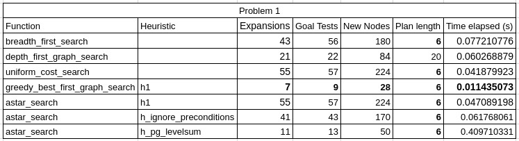
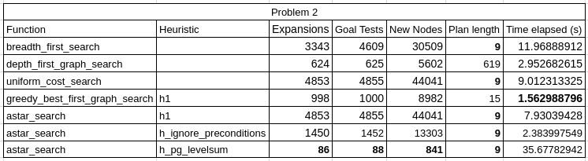
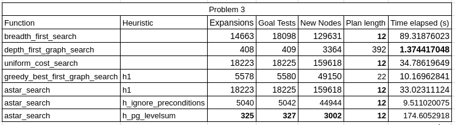

# Air cargo problems analysis

## Problem 1

### Performance comparison



### Optimal plan

**Length: 6**

```
Load(C1, P1, SFO)
Fly(P1, SFO, JFK)
Unload(C1, P1, JFK)
Load(C2, P2, JFK)
Fly(P2, JFK, SFO)
Unload(C2, P2, SFO)
```

## Problem 2

### Performance comparison



### Optimal plan

**Length: 9**

```
Load(C3, P3, ATL)
Fly(P3, ATL, SFO)
Unload(C3, P3, SFO)
Load(C2, P2, JFK)
Fly(P2, JFK, SFO)
Unload(C2, P2, SFO)
Load(C1, P1, SFO)
Fly(P1, SFO, JFK)
Unload(C1, P1, JFK)
```

## Problem 3

### Performance comparison



### Optimal plan

**Length: 12**

```
Load(C2, P2, JFK)
Fly(P2, JFK, ORD)
Load(C4, P2, ORD)
Fly(P2, ORD, SFO)
Unload(C4, P2, SFO)
Load(C1, P1, SFO)
Fly(P1, SFO, ATL)
Load(C3, P1, ATL)
Fly(P1, ATL, JFK)
Unload(C3, P1, JFK)
Unload(C2, P2, SFO)
Unload(C1, P1, JFK)
```

## Analysis

A total of 7 search functions have been evaluated to solve 3 different air cargo problems. Some of the functions were 
uninformed search functions (3) and other were using heuristics for the search (4).

5 out of 7 functions evaluated always gave the optimal solution as a result. The functions that did not were 
`depth_first_graph_search` and `greedy_best_first_graph_search` although `greedy_best_first_graph_search` came to an 
optimal solution for the first problem. In most of the cases, these two functions yielded the result in the least amount
of time, only the `astar_search` with `ignore_preconditions` in the third problem came out with second least elapsed 
time. 

For problem #1, `greedy_best_first_graph_search` came out with an optimal solution in the least amount of time, 
least number of expansions, least goal tests and lest number of new nodes. For problem #2 the same function came out 
with a solution in the least amount of time, but the result was non optimal as the result had a plan length of 15 
instead of the optimal number (9). For the last problem, the function did not came out with a solution in the least 
amount of time but did a descent job compared to some of the other functions (for example 174.6s vs 10.2s). This 
function does not produce an optimal result but the results given are not that bad compared to the optimal result, so it
may be useful for situations where processing time is key.

Overall `depth_first_graph_search` finds a solution in a descent amount of time, but the results given are way too far 
from the optimal result (233.33% more steps for problem #1, 6777.78% for problem #2 and 3166.67% for problem #3). 

If we compare the other functions, the A* searches with `h_ignore_preconditions` and `h_pg_levelsum` (we won't talk 
further about `h1` as it is not a real heuristic) perform better than the uninformed search functions depending on the
priority of the problem. For example if we want a fast and optimal answer, we would choose the A* algorithm with
`h_ignore_preconditions` heuristic, as the results show smaller elapsed times compared to `breadth_first_search` and 
`uniform_cost_search` (we won't compare `depth_first_graph_search` as it does not produce an optimal path). This times 
are better shown in problems #2 and #3 as the problem gets larger, the times grow bigger. If we want to optimize for 
memory space, `h_pg_levelsum` performed better as the number of expansions, goal tests and new nodes was at least 2 
orders of magnitude less compared to uninformed searches. Either way `h_ignore_preconditions` also had less footprint in
those variables, but not as optimized as `h_pg_levelsum`.

Results show that different algorithms should be used depending on the situation we want to address, as sometimes we 
want to optimize speed, other times storage and some other times we just want an answer. Although A* serch with
`h_ignore_preconditions` seem to be the better choice for most of the situations because time is a very sensitive 
variable and finding the optimal choice is better than a suboptimal one